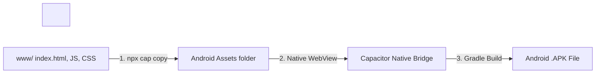
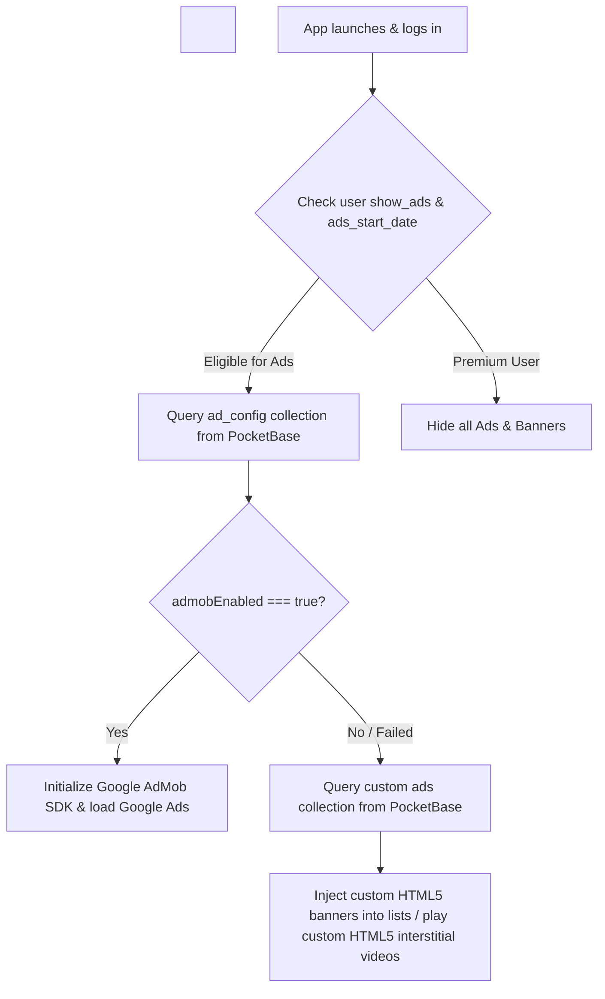
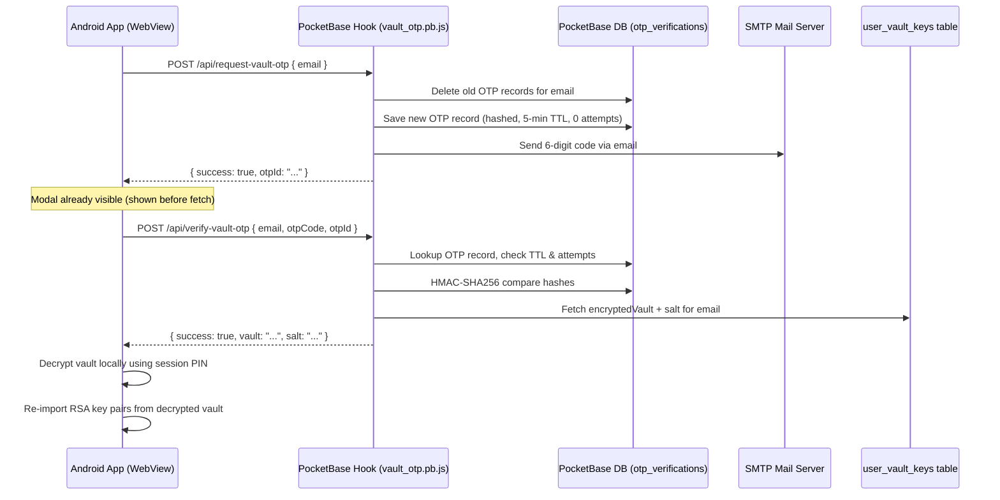

# Mitrava: Complete End-to-End Setup & Architecture Manual

### E2EE Visual Multiplayer Collage Board & Sync System

This manual provides a detailed architectural blueprint, directory mapping, and complete step-by-step setup commands for configuring the entire **Mitrava App** stack (Client, PocketBase, Cloudflare R2, and Firebase Cloud Messaging v1).

---

## 1\. Project Overview & Technology Stack

**Scrap** is a real-time, visual multiplayer collage board application. All user files (images, audio) are encrypted client-side (End-to-End Encryption) before being uploaded directly to Cloudflare R2. Canvas metadata (positions, elements) is synced via PocketBase.

### Tech Stack Details

* **Client App:** HTML5 Canvas, Vanilla CSS3 (with Tailwind offline stylesheet), ES6 Javascript, Capacitor v8 (Native Android wrapper).  
* **Security/Encryption:** Web Crypto API (`window.crypto.subtle`) using AES-GCM (for file contents) and RSA-OAEP (for key sharing).  
* **Database & Auth:** PocketBase (Go/SQLite).  
* **File Storage:** Cloudflare R2 Object Storage (S3-compatible).  
* **Push Notifications:** Firebase Cloud Messaging (FCM) HTTP v1 API.

---

## 2\. Directory Structure Mapping

```text
e:\Scrap-App\
├── android\                    # Android Studio Native Java Project
│   ├── app\
│   │   ├── google-services.json # Firebase Config (Download from Firebase Console)
│   │   └── src\main\AndroidManifest.xml # Android settings & permissions
│   └── variables.gradle        # Target SDK (36) and plugin dependencies configuration
├── www\                        # Client Web Assets
│   ├── index.html              # Main HTML entry point
│   ├── css\
│   │   └── app.css             # Main styling stylesheet
│   ├── lib\                    # Offline libraries (Tailwind, PocketBase SDK)
│   └── js\
│       ├── app.js              # Application core UI logic & routing
│       ├── canvas.js           # Interactive multiplayer drawing board rendering
│       ├── pocketbase.js       # Sync layer client code for PocketBase
│       ├── r2upload.js         # Presigned URL S3 client uploader
│       ├── r2database.js       # File buffer and caching system
│       ├── notifications.js    # Client-side push notification registry
│       ├── safety.js           # Client-side pixel-density content moderation
│       ├── crypto.js           # AES-GCM/RSA-OAEP WebCrypto wrapper
│       └── recovery.js         # Cryptographic key backup & recovery interface
├── capacitor.config.json       # App ID and Capacitor Configuration
└── package.json                # Project dependencies (Capacitor, plugins, DevTools)
```

---

## 3\. Client App Setup (Local Development)

Follow these steps to set up the client codebase and build the Android APK.

### Prerequisites (Install on your local machine)

* **Node.js** (v18 or higher) & **npm**.  
* **Java Development Kit (JDK 17\)**.  
* **Android Studio** (for compilation and emulation).

### How the HTML Project is Converted to an Android App

This application uses **Capacitor** to bridge the gap between web files (HTML, JS, CSS) and a native Android Application package (APK).



Here is the exact process:

1. **The Webview Shell:** Capacitor creates a native Android Java shell that launches a fullscreen, high-performance **Android WebView** (an embedded Chrome browser).  
2. **Asset Copying:** When you run `npx cap sync`, Capacitor copies all static web assets from your `www/` directory directly into the Android source code assets folder: `android/app/src/main/assets/public/`.  
3. **JS-to-Native Bridge:** During runtime, Capacitor exposes a global `Capacitor.Plugins` JavaScript interface. When your JS code requests features (like opening the camera), the bridge intercepts the request and executes native Java code on the device.  
4. **Gradle Compilation:** Android Studio uses **Gradle** to compile the Java wrapper, Cordova/Capacitor plugins, and webview assets into a single signed or unsigned `.apk` package ready to run on physical devices or submit to the Play Store.

### Step-by-Step Build Commands:

1. **Navigate to project directory:**  
   ```powershell
   cd E:\Scrap-App
   ```  
2. **Install the Capacitor CLI globally (if not already installed):**  
   ```powershell
   npm install -g @capacitor/cli
   ```  
3. **Install all project dependencies (listed in package.json):**  
   ```powershell
   npm install
   ```  
4. **Add the Android Native Platform shell (Only required the first time setting up the project):**  
   ```powershell
   npx cap add android
   ```  
5. **Synchronize Web Assets and Plugins with the Android project:**  
   ```powershell
   npx cap sync
   ```  
6. **Compile and run the app in Android Studio (for Emulator/Device):**  
   ```powershell
   npx cap open android
   ```  
   *(This launches Android Studio. From there, select your device/emulator and click the green **Run** button to launch and test)*.

### Cordova Plugins Integration in Capacitor

Capacitor has native support for legacy Cordova plugins. When you install a Cordova plugin via `npm`, Capacitor automatically detects it and builds the native bridge classes during the synchronization process.

#### How to Install Cordova Plugins:

1. **Install the plugin via npm:** To add a Cordova plugin (for example, the Fingerprint Biometric plugin `cordova-plugin-fingerprint-aio` used in this project):

```shell
npm install cordova-plugin-fingerprint-aio
```

2. **Synchronize Capacitor:** Always run the Capacitor sync command after installing any Cordova or Capacitor plugin to update the Android source code:

```shell
npx cap sync
```

   *(Capacitor will automatically find the plugin in `package.json`, create the native Java/Kotlin bindings, and link it inside `android/capacitor-cordova-android-plugins/`)*.

### App Plugins Reference Table

Here are the active plugins configured in `package.json` that interface directly with the device's native hardware and Operating System:

| Plugin Name | Type | Purpose / Why We Need It |
| :---- | :---- | :---- |
| **`@capacitor-community/speech-recognition`** | Capacitor | Implements voice-to-text input to allow users to dictate text directly onto the drawing board/sticky notes. |
| **`@capacitor-mlkit/barcode-scanning`** | Capacitor | Fast on-device QR Code scanner used to parse invite links and crypto room keys. |
| **`@capacitor/app`** | Capacitor | Intercepts system events such as native Android hardware Back Button actions and app backgrounding/foregrounding. |
| **`@capacitor/camera`** | Capacitor | Opens the native device camera and media library to capture/select photos to place directly on the collage boards. |
| **`@capacitor/filesystem`** | Capacitor | Manages local on-device disk storage. Used to save and load cached media files locally with a 14-day expiry to reduce network downloads. |
| **`@capacitor/keyboard`** | Capacitor | Detects software keyboard visibility events to dynamically shift the UI drawer input boxes so they don't get covered by the keyboard. |
| **`@capacitor/preferences`** | Capacitor | Secure, lightweight local key-value storage. Stores local app settings, themes, locked/unlocked keys, and session metadata. |
| **`@capacitor/push-notifications`** | Capacitor | Handles device push registration, notification channels, and registers FCM push tokens back to the server. |
| **`@capgo/capacitor-audio-recorder`** | Capacitor | Accesses the native microphone to record high-quality voice notes to upload and pin on the collage. |
| **`cordova-plugin-fingerprint-aio`** | Cordova | Integrates biometric verification (Fingerprint / FaceID / PIN) to lock or decrypt the app vault lock screen. |
| @capacitor/share | Cordova | Enable Native App Icons (WhatsApp, Instagram, Gmail)&nbsp; |

---

## 4\. Cloudflare R2 Storage Setup

Direct uploads bypass your server entirely to save bandwidth.

### Step 1: Create a Bucket

1. Log in to your **Cloudflare Dashboard**.  
2. Navigate to **R2 Object Storage** → click **Create Bucket**.  
3. Name your bucket (e.g., `myscrap-media`) and click Create.

### Step 2: Configure CORS (Crucial for Client Uploads)

Since the client app uploads files directly to R2 from the device webview, you must allow Cross-Origin Requests.

1. Click on your bucket (`myscrap-media`) → go to the **Settings** tab.  
2. Under **CORS Policy**, click **Add CORS Policy** and paste this JSON:

```json
[
  {
    "AllowedOrigins": [
      "https://localhost",
      "http://localhost",
      "capacitor://localhost",
      "https://api.myscrapmemories.com",
      "*"
    ],
    "AllowedMethods": [
      "GET",
      "PUT",
      "POST",
      "DELETE",
      "HEAD"
    ],
    "AllowedHeaders": [
      "*"
    ],
    "ExposeHeaders": [
      "ETag"
    ],
    "MaxAgeSeconds": 3600
  }
]
```

Click Save.

### Step 3: Generate S3 API Credentials

1. Go to **R2 Object Storage** (main page) → click **Manage R2 API Tokens** (on the right).  
2. Click **Create API Token**.  
3. Set permissions to **Admin Read & Write**.  
4. Click Create and copy the credentials:  
   * `Access Key ID` (Used on server).  
   * `Secret Access Key` (Used on server).  
   * `S3 Endpoint URL` (Used on server, format: `https://<account_id>.r2.cloudflarestorage.com`).&nbsp;

&nbsp;&nbsp;&nbsp;&nbsp;5\.    Add above sensitive data in .env file

### Step 4: Media Specifications & File Size Limits

Below is the complete matrix of maximum file size limits, resolution caps, and processing pipelines enforced for media across the application:

| Media Type | Feature / Usage | Maximum Size Limit | Resolution / Format / Quality Handling | Technical Implementation |
| :---- | :---- | :---- | :---- | :---- |
| **Photo / Image** | Original Gallery Pick | **5 MB** (`5,242,880 bytes`) | Multi-pass JPEG compression (75% to 50%) down to 800px square crop | `ScrapApp.compressImage()` in [`app.js`](file:///e:/Scrap-App/www/js/app.js#L6926) |
| **Photo / Image** | Canvas Snapshots | **≤ 200 KB** per snapshot | Dynamic canvas scale-down & quality reduction before AES-GCM encryption | `compressToBlob()` in [`app.js`](file:///e:/Scrap-App/www/js/app.js#L5733) |
| **Photo / Image** | Profile & Room Avatars | **50 KB** | Center-cropped square JPEG, scaled to 512×512px max dimension | `ScrapPocketBase.compressImage()` in [`pocketbase.js`](file:///e:/Scrap-App/www/js/pocketbase.js#L927) |
| **Photo / Image** | Custom Theme Backgrounds | **200 KB** | JPEG format scaled to 1920px max dimension | `uploadUserCustomBg()` in [`pocketbase.js`](file:///e:/Scrap-App/www/js/pocketbase.js#L1012) |
| **Video** | Gallery Pick & Recording | **10 MB** (`10,485,760 bytes`) | Hardcoded code check; uploads larger than 10 MB trigger an alert dialog and abort | `processVideoFile()` in [`app.js`](file:///e:/Scrap-App/www/js/app.js) |
| **Audio** | Voice Notes & Audio Clips | **10 MB** (approx. 3-5 min recording) | WebM/AAC compressed audio buffer recorded via native device microphone | `@capgo/capacitor-audio-recorder` in [`app.js`](file:///e:/Scrap-App/www/js/app.js) |

#### 🎥 Video File Size Verification in Code

* **Explicit 10 MB Code Limit:** In [`app.js`](file:///e:/Scrap-App/www/js/app.js), `processVideoFile(file)` enforces an explicit code check (`const maxSize = 10 * 1024 * 1024;`). If a user selects a video larger than 10 MB from the device gallery, the upload is blocked and an alert dialog is displayed: *"Video file is too large. Please keep videos under 10MB to save storage and ensure instant loading."*  
* **Cloudflare R2 Direct Transfer:** Videos under 10 MB bypass the PocketBase server and upload directly to Cloudflare R2 using S3 pre-signed URLs ([`r2upload.js`](file:///e:/Scrap-App/www/js/r2upload.js)).

#### 🎵 Audio File & Voice Note Details

* **Voice Note Recording:** Audio notes are captured directly using native mobile microphone APIs, formatted into AAC/WebM audio buffers up to **10 MB**.  
* **Spatial Audio Engine:** In-room background audio and spatial audio stickers stream via Web Audio API (`AudioContext`) with dynamic gain and panning nodes.

### Step 5: S3 / Cloudflare R2 URL Construction Architecture

Media files and encrypted assets are uploaded using secure S3 pre-signed URLs generated dynamically by the PocketBase backend to bypass server bandwidth bottlenecking:

1. **Why S3 Pre-Signed Links are Used:**  
   * **Bypassing Server Bottlenecks:** Direct client-to-R2 transfer saves backend server bandwidth, CPU, and RAM.  
   * **API Key Security:** Private S3 credentials (`R2_ACCESS_KEY_ID`, `R2_SECRET_ACCESS_KEY`) remain securely stored on the server and are never exposed in client JavaScript.  
2. **Pre-Signed URL Generation (`/api/r2-presign`):**  
   * **Client Request:** The client app calls PocketBase server endpoint [`/api/r2-presign`](file:///e:/Scrap-App/www/js/r2upload.js#L15) via `window.pb.send()`.  
   * **Query Parameters:**  
     * `filename`: User-sanitized filename prefix (`${safeUsername}_${fileName}`).  
     * `method`: Requested S3 HTTP verb (`PUT` for upload, `GET` for download, `DELETE` for removal).  
     * `mimeType`: Content MIME type (e.g., `image/jpeg`, `video/mp4`, `audio/webm`, `application/octet-stream`).  
   * **Backend Response:** `{ "uploadUrl": "https://<account_id>.r2.cloudflarestorage.com/myscrap-media/<filename>?X-Amz-Algorithm=..." }`.  
3. **How Cloudflare Validates Pre-Signed URLs (AWS Signature V4):**  
   * When generating the pre-signed URL, the PocketBase server creates a cryptographic HMAC-SHA256 signature (`X-Amz-Signature`) using its private `R2_SECRET_ACCESS_KEY`.  
   * When the mobile app issues a `PUT` or `GET` request directly to Cloudflare R2, Cloudflare edge servers verify the signature against their copy of your secret key.  
   * If the signature is valid and has not expired, Cloudflare grants access; otherwise it returns `403 Forbidden`.  
4. **PocketBase System Files URL Structure (Avatars, Custom Backgrounds, Ads):**  
   * **Base Pattern:** `https://api.myscrapmemories.com/api/files/{collection_id_or_name}/{record_id}/{file_name}`  
   * **Collections & Fields:**  
     * User Avatars: `/api/files/users/{userId}/{avatar}`  
     * Room Avatars: `/api/files/boards/{roomId}/{avatar}`  
     * Custom Theme Backgrounds: `/api/files/users/{userId}/{custom_bg}`  
     * Custom Ads / Banners: `/api/files/ads/{adId}/{file}`

---

## 5\. PocketBase Server Setup

Follow these steps to deploy and configure your remote backend server.

### Step 1: Server Folders and Permissions

1. Access your server terminal and create the pocketbase directory structure:

```shell
mkdir -p /home/adminuser/pocketbase/pb_hooks
mkdir -p /home/adminuser/pocketbase/pb_data
```

2. Download the PocketBase binary (e.g. Linux version):

```shell
cd /home/adminuser/pocketbase
wget https://github.com/pocketbase/pocketbase/releases/download/v0.21.3/pocketbase_0.21.3_linux_amd64.zip
unzip pocketbase_0.21.3_linux_amd64.zip
```

3. Set the correct execution ownership to your running user (e.g., `adminuser`):

```shell
sudo chown -R adminuser:adminuser /home/adminuser/pocketbase
sudo chmod -R 775 /home/adminuser/pocketbase
```

### Step 2: Setup systemd Service

Create the service descriptor file to keep PocketBase online:

```shell
sudo nano /etc/systemd/system/pocketbase.service
```

Paste this configuration:

```ini
[Unit]
Description=PocketBase Service
After=network.target

&nbsp;

[Service]
Type=simple
User=adminuser
Group=adminuser
WorkingDirectory=/home/adminuser/pocketbase
ExecStart=/home/adminuser/pocketbase/pocketbase serve

&nbsp;

# Cloudflare R2 Credentials
Environment="R2_ACCESS_KEY_ID=your_r2_access_key"
Environment="R2_SECRET_ACCESS_KEY=your_r2_secret_key"
Environment="R2_ENDPOINT=https://<your_account_id>.r2.cloudflarestorage.com"
Environment="R2_BUCKET=myscrap-media"

&nbsp;

# Google FCM server key (if using FCM)
Environment="FCM_SERVER_KEY=your_fcm_legacy_server_key_if_applicable"

&nbsp;

Restart=always

&nbsp;

[Install]
WantedBy=multi-user.target
```

Reload and start the service:

```shell
sudo systemctl daemon-reload
sudo systemctl enable pocketbase
sudo systemctl start pocketbase
```

### Step 3: Create Collections Schema (Admin UI)

Access your dashboard at `https://yourdomain.com/_/` and configure the following collections:

1. **`users` Collection (System):**  
   * Edit schema and add:  
     * `fcm_token` (Type: Plain Text)  
     * `show_ads` (Type: Boolean)  
     * `ads_start_date` (Type: Plain Text / Date)  
2. **`boards` Collection:**  
   * Fields:  
     * `title` (Type: Plain Text)  
     * `board_date` (Type: Plain Text)  
     * `board_state` (Type: Plain Text / JSON)  
     * `user` (Relation, Single, target: `users`)  
     * `members` (Relation, Multiple, target: `users`)  
     * `media` (Type: JSON / List of text)  
3. **`presence` Collection:**  
   * Fields:  
     * `user` (Relation, Single, target: `users`)  
     * `board` (Type: Plain Text / ID)  
     * `username` (Type: Plain Text)  
     * `x` (Type: Number)  
     * `y` (Type: Number)  
     * `last_active` (Type: Plain Text)

---

## 6\. Push Notifications Setup (FCM HTTP v1 Pipeline)

FCM v1 requires generating OAuth2 keys because Google has retired legacy static API keys.

```mermaid
sequenceDiagram
&nbsp;&nbsp;&nbsp;&nbsp;participant Client as Capacitor Client App
&nbsp;&nbsp;&nbsp;&nbsp;participant PB as PocketBase Server
&nbsp;&nbsp;&nbsp;&nbsp;participant Helper as Token Helper Daemon
&nbsp;&nbsp;&nbsp;&nbsp;participant FCM as Firebase Messaging v1

&nbsp;

&nbsp;&nbsp;&nbsp;&nbsp;Client->>PB: Saves Client device fcm_token in DB
&nbsp;&nbsp;&nbsp;&nbsp;Note over Client, PB: Triggered on user action
&nbsp;&nbsp;&nbsp;&nbsp;Client->>PB: Updates Board data
&nbsp;&nbsp;&nbsp;&nbsp;PB->>Helper: GET http://127.0.0.1:3000/token
&nbsp;&nbsp;&nbsp;&nbsp;Helper->>PB: Returns short-lived OAuth2 Access Token
&nbsp;&nbsp;&nbsp;&nbsp;PB->>FCM: POST /messages:send with Bearer Token
&nbsp;&nbsp;&nbsp;&nbsp;FCM->>Client: Delivers Native Notification Alert
```

### Setup Step 1: Install Node.js & npm on Server

If not installed, run this on your server:

* **Ubuntu/Debian:**

```shell
sudo apt update && sudo apt install nodejs npm -y
```

* **CentOS/RHEL:**

```shell
sudo dnf install nodejs npm -y
```

### Setup Step 2: Configure FCM Token Helper

1. Create a directory for authentication helpers:

```shell
mkdir -p /home/adminuser/pocketbase/fcm_auth
cd /home/adminuser/pocketbase/fcm_auth
```

2. Initialize Node module and install Google Auth dependency:

```shell
npm init -y
npm install google-auth-library
```

3. Download your service account private key JSON from **Firebase Console \> Project Settings \> Service Accounts**, save it in this directory, and rename it to `service-account.json`.  
4. Create the helper server file:

```shell
nano server.js
```

   Paste the following:

```javascript
const { GoogleAuth } = require('google-auth-library');
const http = require('http');

const auth = new GoogleAuth({
  keyFile: './service-account.json',
  scopes: ['https://www.googleapis.com/auth/firebase.messaging'],
});

const server = http.createServer(async (req, res) => {
  if (req.url === '/token') {
    try {
      const client = await auth.getClient();
      const token = await client.getAccessToken();
      res.writeHead(200, { 'Content-Type': 'application/json' });
      res.end(JSON.stringify({ token: token.token }));
    } catch (err) {
      res.writeHead(500, { 'Content-Type': 'application/json' });
      res.end(JSON.stringify({ error: err.message }));
    }
  } else {
    res.writeHead(404);
    res.end();
  }
});

server.listen(3000, '127.0.0.1', () => {
  console.log('FCM Token Helper running on http://127.0.0.1:3000');
});
```

5. Install and configure **PM2** to run the helper daemon permanently in the background:

```shell
# Install PM2 globally
sudo npm install -g pm2

# Start the server.js script under the process name "fcm-helper"
pm2 start server.js --name "fcm-helper"

# Configure PM2 to launch on system startup/boot
pm2 startup
# (Copy and execute the output command printed by the terminal)

# Save the running process list to preserve it across reboots
pm2 save
```

   **PM2 Management Commands Cheat Sheet:**

```shell
# View status of running processes
pm2 list

# Stream real-time helper console logs (useful for testing)
pm2 logs fcm-helper

# Restart the fcm-helper service
pm2 restart fcm-helper

# Stop the fcm-helper service
pm2 stop fcm-helper
```

### Setup Step 3: Deploy Backend JS Hook

Create file `/home/adminuser/pocketbase/pb_hooks/notifications.pb.js`: *(Replace `"YOUR-FIREBASE-PROJECT-ID"` on line 52 with the `project_id` value from `service-account.json`)*

```javascript
// pb_hooks/notifications.pb.js
onRecordAfterUpdateRequest((e) => {
  try {
    const board = e.record;
    const boardTitle = board.get("title") || "Squad Space";
    const boardId = board.id;
    
    const activeUser = e.auth; 
    const activeUserName = activeUser ? (activeUser.get("name") || activeUser.get("username") || "Someone") : "Someone";
    const activeUserId = activeUser ? activeUser.id : "";

    let members = board.get("members") || [];
    if (typeof members === 'string') {
      try { members = JSON.parse(members); } catch(err) { members = []; }
    }
    const creatorId = board.get("user");
    if (creatorId && members.indexOf(creatorId) === -1) {
      members.push(creatorId);
    }

    const targetUserIds = members.filter(function(id) {
      return id !== activeUserId;
    });

    if (targetUserIds.length === 0) return;

    const pushTokens = [];
    targetUserIds.forEach(function(userId) {
      try {
        const userRecord = $app.dao().findRecordById("users", userId);
        const token = userRecord.get("fcm_token");
        if (token && token.trim() !== "") {
          pushTokens.push(token);
        }
      } catch (err) {}
    });

    if (pushTokens.length === 0) return;

    // Get OAuth2 token from local Node helper
    const tokenRes = $http.send({ url: "http://127.0.0.1:3000/token", method: "GET" });
    if (tokenRes.statusCode !== 200) return;
    const accessToken = JSON.parse(tokenRes.raw).token;

    const firebaseProjectId = "YOUR-FIREBASE-PROJECT-ID";

    pushTokens.forEach(function(token) {
      try {
        $http.send({
          url: "https://fcm.googleapis.com/v1/projects/" + firebaseProjectId + "/messages:send",
          method: "POST",
          headers: {
            "Content-Type": "application/json",
            "Authorization": "Bearer " + accessToken
          },
          body: JSON.stringify({
            message: {
              token: token,
              notification: {
                title: boardTitle,
                body: activeUserName + " added new content to the board!"
              },
              android: {
                notification: {
                  channel_id: "scrap_activity"
                }
              },
              data: {
                roomId: boardId
              }
            }
          })
        });
      } catch (fcmErr) {}
    });
  } catch (err) {
    console.error("[Notifications] Hook error:", err.message);
  }
}, "boards");
```

Restart PocketBase to compile and run:

```shell
sudo systemctl restart pocketbase
```

---

## 7\. Advertising & Monetization Pipeline (AdMob & Custom Ads)

The Scrap App features a dual-layer advertising engine implemented in [`www/js/ads.js`](file:///e:/Scrap-App/www/js/ads.js) that toggles dynamically between Google AdMob and custom, self-hosted promotional campaigns based on backend config.



### 1\. Database Collections Config

The ad engine requires two PocketBase collections:

* **`ad_config` (Single record):**  
  * `admobEnabled` (Boolean): Master switch to toggle AdMob on/off.  
  * `admobBannerUnitId` / `admobInterstitialUnitId` (Text): Production AdMob ad codes.  
  * `adEveryNRooms` (Number): Dynamic frequency spacing for card list ads.  
  * `interstitialEveryNSaves` (Number): Number of canvas updates before triggering full screen ads.  
* **`ads` (Multiple records):**  
  * `title` (Text): Campaign name.  
  * `type` (Text): `"banner"` (in-line image) or `"video"` (interstitial overlay).  
  * `file` (File upload): The image/video asset stored in PocketBase files.  
  * `url` (Text): Click destination target webpage.

### 2\. Ad Skipping/Bypassing

Ads are automatically bypassed if:

1. `user.show_ads === false` (Premium account indicator).  
2. The current local date is before `user.ads_start_date` (Grace period for new registrations).

---

## 8\. How to Run the Project from a Fresh Git Clone (Quickstart)

If you are cloning this repository for the first time, follow these steps to build and run the app:

### Step 1: Install Local Prerequisites

Verify the following are installed:

* **Node.js** (v18+) & **npm**.  
* **Java Development Kit (JDK 17\)**.  
* **Android Studio** (with Android SDK installed).

### Step 2: Clone and Install Packages

Open your terminal/command prompt and run:

```shell
# 1. Clone the project
git clone <your-git-repo-url>
cd Scrap-App

# 2. Install Capacitor CLI globally (if you don't have it)
npm install -g @capacitor/cli

# 3. Install NPM dependencies
npm install
```

### Step 3: Verify configuration files

* Ensure **`android/app/google-services.json`** is present inside the folder. (If you want to use your own Firebase project, download and replace this file).

### Step 4: Synchronize assets and plugins

Generate native plugin links and copy the web files:

```shell
npx cap sync
```

### Step 5: Build & Run in Android Studio

Launch Android Studio with the project workspace loaded:

```shell
npx cap open android
```

1. Wait for Android Studio's background **Gradle sync** to complete (this happens automatically on launch).  
2. Plug in your physical Android phone (ensure USB debugging is on) or start a Virtual Device (Emulator).  
3. Click the green **Run (Play)** button in Android Studio. The app will compile and install on your device.

&nbsp;

---

## 9\. Email OTP Vault Key Recovery System

This section documents the full technical architecture of the **Email One-Time Password (OTP) Key Vault Recovery** feature, which allows users to restore their encrypted cryptographic vault to a new device after reinstalling the app, without storing any plaintext keys on the server.

### 9.1 Why OTP Vault Recovery Is Needed

When a user reinstalls the app, their **local cryptographic key vault is lost** (it was stored only in `localStorage`). Without vault recovery, the user permanently loses access to all their encrypted photos and memories. The OTP system solves this by allowing vault recovery via a verified email challenge, without ever transmitting the actual encryption keys in plaintext.

### 9.2 System Architecture Overview



### 9.3 PocketBase Hook Endpoints (`pb_hooks/vault_otp.pb.js`)

Three server-side hook endpoints handle the complete OTP lifecycle:

#### `POST /api/sync-user-vault`
Saves (or updates) the user's **AES-256-GCM encrypted vault payload** to the server, keyed by email address. Called non-blocking after every vault write.

| Parameter | Type | Description |
|:---|:---|:---|
| `email` | String | User's email (normalized to lowercase) |
| `vault` | String (Base64) | AES-256-GCM encrypted vault blob |
| `salt` | String (Base64) | PBKDF2 random salt used to derive AES key from PIN |

**Storage Table:** `user_vault_keys` (fields: `email`, `encryptedVault`, `salt`, `updatedAt`)

#### `POST /api/request-vault-otp`
Generates, hashes, stores, and emails the 6-digit OTP code.

**Security Steps:**
1. Verifies a vault record exists for the email (returns `404` if no backup found).
2. Deletes all previous OTP records for that email (single active OTP policy).
3. Generates a cryptographically random 6-digit code: `Math.floor(100000 + Math.random() * 900000)`.
4. Hashes the code with HMAC-SHA256: `$security.hs256(otpCode, "SCRAP_VAULT_OTP_SALT_2026")` — **the plaintext code is never stored**.
5. Saves `{ email, otpHash, attempts: 0, expiresAt: now + 5min }` to `otp_verifications` table.
6. Sends HTML email with code via PocketBase SMTP client (`$app.newMailClient().send()`).

**Response:** `{ success: true, otpId: "<record_id>" }`

#### `POST /api/verify-vault-otp`
Verifies the submitted OTP code and returns the encrypted vault if valid.

| Check | Action on Failure |
|:---|:---|
| OTP record exists | Returns `400`: "No active OTP request found" |
| `expiresAt > now` (5-min TTL) | Deletes record, returns `400`: "OTP code has expired" |
| Failed attempt counter < 3 | Increments `attempts`, returns `400` with remaining attempts |
| HMAC-SHA256 hash matches | Proceeds to vault fetch |
| 3 consecutive failures | Deletes OTP, sends **security intrusion alert email** to admin, returns `429` |

**On success:** Deletes OTP record (single-use enforcement), returns `{ success: true, vault: "...", salt: "..." }`.

### 9.4 Client-Side Flow (`recovery.js` + `app.js`)

#### OTP Request with 15-Second Network Timeout
```javascript
// recovery.js — requestOtpKeyRecovery()
const controller = new AbortController();
const timeout = setTimeout(() => controller.abort(), 15000); // 15s hard timeout
const res = await fetch(`${pbUrl}/api/request-vault-otp`, {
  method: 'POST',
  headers: { 'Content-Type': 'application/json' },
  body: JSON.stringify({ email }),
  signal: controller.signal  // Abort after 15s on mobile network hang
});
// AbortError → throws "Request timed out. Check your internet connection."
```

#### Android Modal: Show First, Fetch Later
The critical Android WebView fix: the modal renders **before** the network request fires. Previously, the modal only appeared after the server responded — causing a blank screen if the network was slow.

```
User taps "Recover Key Vault via Email OTP"
         ↓
Modal appended to document.body immediately (z-index: 2147483647)
         ↓
Background IIFE fires requestOtpKeyRecovery() async
         ↓
Status row shows "⏳ Sending OTP to your email..."
OTP inputs disabled, Verify button greyed out
         ↓
On success → inputs unlock, button turns gold
On timeout (15s) → "❌ Request timed out" + Resend button activates
On server error → "❌ Failed to send OTP: <reason>" + Resend activates
```

#### Vault Decryption After OTP Verification
Once the server returns the encrypted vault blob:
```javascript
// recovery.js — verifyOtpAndRestoreVault()
const pin = sessionStorage.getItem('scrap_pin_session') || '000000';
const restored = await this.unlockIdentity(pin, data.vault, data.salt);
// unlockIdentity: PBKDF2(pin, salt) → AES-GCM key → decrypt vault JSON
// Re-imports RSA-PSS identity keypair and RSA-OAEP encryption keypair
```

### 9.5 Security Layers Summary

| Layer | Mechanism |
|:---|:---|
| Code never stored plaintext | HMAC-SHA256 hash only (`hs256`) |
| Time-limited | 5-minute TTL on `expiresAt` field |
| Brute force protection | Max 3 failed attempts → OTP destroyed + admin alert |
| Single-use | OTP record deleted immediately on successful verification |
| Network timeout | `AbortController` 15s timeout on all OTP fetches |
| Vault encrypted at rest | AES-256-GCM with PBKDF2-derived key from user's PIN |
| Intrusion alerting | Admin security email on 3 consecutive failures |

### 9.6 PocketBase Collections Required

| Collection | Fields |
|:---|:---|
| `user_vault_keys` | `email` (Text), `encryptedVault` (Text/JSON), `salt` (Text), `updatedAt` (Text) |
| `otp_verifications` | `email` (Text), `otpHash` (Text), `attempts` (Number), `expiresAt` (Text) |

### 9.7 SMTP Configuration (DigitalOcean Hosting Note)

> ⚠️ **DigitalOcean blocks all outbound SMTP ports (25, 465, 587) by default** on new Droplets. Direct Zoho/Gmail SMTP will time out. Use **SendGrid SMTP relay** as a workaround:
>
> | Field | Value |
> |:---|:---|
> | SMTP Host | `smtp.sendgrid.net` |
> | Port | `587` |
> | Security | TLS (STARTTLS) |
> | Username | `apikey` (literal string) |
> | Password | Your SendGrid API Key |

---

## 10\. Low Bandwidth Upload Resilience System

This section documents how the app handles photo uploads on unstable mobile networks (2G/3G/weak 4G) without losing data or getting stuck in infinite loading states.

### 10.1 Image Compression Pipeline (`app.js → compressImage()`)

Before any upload attempt, photos are compressed client-side to minimize bandwidth usage:

```
User selects photo from gallery
         ↓
compressImage(file, maxSize = 5,242,880 bytes)
         ↓
FileReader → Image element → HTML5 Canvas
         ↓
Center-crop to square (removes letterboxing)
         ↓
Scale down to max 800×800 pixels
         ↓
Multi-pass JPEG compression:
  Pass 1: quality = 0.75
  Pass 2: quality = 0.60 (if still > maxSize)
  Pass 3: quality = 0.50 (if still > maxSize)
         ↓
Output: Blob (JPEG, ≤5MB)
```

**Result:** A 15MB RAW camera photo is typically reduced to **200–400 KB** before encryption and upload — an ~97% size reduction.

### 10.2 AES-256-GCM Encryption Before Upload

After compression, the image bytes are encrypted **in RAM** using the room's AES-GCM key before touching the network:

```javascript
// Encrypt in-memory — never writes plaintext to disk or server
const encryptedBuffer = await ScrapCrypto.encryptWithRoomKey(roomKey, arrayBuffer);
// Result: AES-256-GCM ciphertext blob (application/octet-stream)
```

### 10.3 Cloudflare R2 Upload with Exponential Retry (`app.js → uploadWithRetry()`)

After encryption, the upload uses a **3-attempt recursive retry** with a 1.5-second delay between attempts — specifically designed for mobile network glitches:

```javascript
const uploadWithRetry = async (retriesLeft = 3) => {
  try {
    // 1. Resolve room folder in R2 (creates if not exists)
    const roomFolderId = await ScrapDrive.resolveRoomFolder(roomId, title, date);

    // 2. Upload encrypted buffer via S3 pre-signed PUT URL
    const uploadResult = await ScrapDrive.uploadFile(
      fileName, encryptedBuffer, roomFolderId, 'application/octet-stream'
    );

    if (uploadResult && uploadResult.id) {
      // 3. Update element metadata in Firebase/PocketBase with confirmed fileId
      currentEl.fileId = uploadResult.id;
      delete currentEl._pendingFileName;   // Remove pending state flag
      delete currentEl._isPendingSync;
      await ScrapFirebase.saveElement(roomId, elementId, currentEl);
    }

  } catch (err) {
    if (retriesLeft > 0) {
      // Wait 1.5s then retry (handles brief signal drops)
      await new Promise(r => setTimeout(r, 1500));
      return uploadWithRetry(retriesLeft - 1);  // Recursive retry
    } else {
      // All 3 attempts failed → hand off to background sync queue
      setTimeout(() => window.ScrapFirebase.flushPendingSyncQueue(), 3000);
    }
  }
};
```

### 10.4 Retry Failure States

| Attempt | Outcome |
|:---|:---|
| Attempt 1 | Upload tried. On failure: wait 1.5s → Attempt 2 |
| Attempt 2 | Upload retried. On failure: wait 1.5s → Attempt 3 |
| Attempt 3 | Upload retried. On failure: hand off to background sync queue |
| Background Queue | `flushPendingSyncQueue()` fires 3s later when connectivity recovers |

### 10.5 Pending State Tracking

While waiting for upload confirmation, the element is tagged with pending flags so the canvas knows to show it in a "syncing" visual state:

```javascript
metadata._pendingFileName = fileName;  // Temporary local filename
metadata._isPendingSync = true;        // Renders with "syncing" indicator
```

These flags are **cleared only after** the R2 upload succeeds and the confirmed `fileId` is written back to Firebase. If the user closes the app mid-upload, `flushPendingSyncQueue()` retries on next launch.

### 10.6 Dynamic fileId Resolution (Real-Time Sync)

When a second user's device receives a real-time canvas update, it resolves the photo's `fileId` dynamically to handle the case where the first user's upload hasn't completed yet:

```javascript
// canvas.js — decryptAndDisplayImage()
// Prefer server-confirmed fileId over locally-generated temp filename
const fileId = serverEl.fileId || localEl.fileId || localEl._pendingFileName;
```

This prevents "photo not found" errors on User 2's screen while User 1's upload is still in progress on a slow connection.

&nbsp;